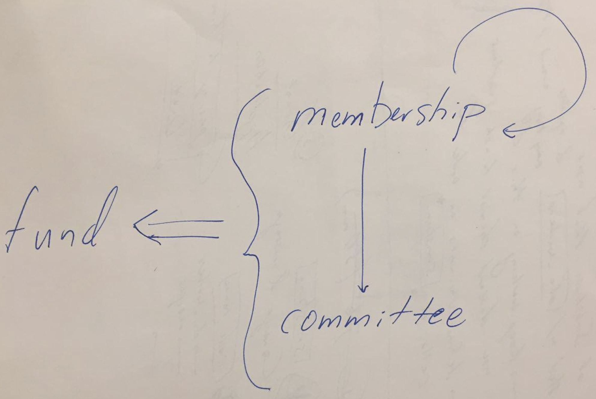

# modules

* [committee](./committee), inspired by `council`
* [fund](./fund/), inspired by `treasury`
* [membership](./membership/), inspired by `membership`
* [voting](./voting/), inspired by `elections`

## runtime configuration

sunshine's runtime configuration uses the `voting` module to make different internal decisions:
* `membership` is voted on by the `member`s using their `shares` `=>` the required quorum threshold should be adjustable `=>` additional feature is to make projections on how this will change but this feature has to be added in (see `vote/futarchy/`)
* `committee` is selected by the `member`s using Phragmen with the `member` shares `=>` the committee does not generate any reward but maintains turnout bias for all `fund` decisions (see next decision type)
* `fund` is similar to `treasury`, but provides nuanced governance of the assets held by the organization `=>` a key feature is the parameterization discussed briefly in `monetary-futarchy`

The `voting` module is designed to be highly configurable to provide nuanced governance over the DAO's `membership`, `committee`, and `fund`. Each of the arrows in the above diagram requires a different configuration of the `voting` module in the runtime. In this sense, the arrows represent governance of a stakeholder set over internal decisions.

## why not just use original srml modules? 

This project is designed to explore experimental features that may be eventually proposed for use in the Polkadot treasury. These features might include
- [ ] DAOs as first-class members of other DAOs
- [ ] the ability to merge and split DAOs *gracefully*
- [ ] structured process for crowdfunding DAOs (and an investment criteria for D2D investment)
- [ ] lending criteria for DAOs (which could also consider membership credit composition)

In many ways, this project pulls heavily from patterns in [`srml/{`]()[`membership, `]()[`council, `]()[`elections, `]()[`democracy, `]()[`staking, `]()**[`treasury`]()** among others. 